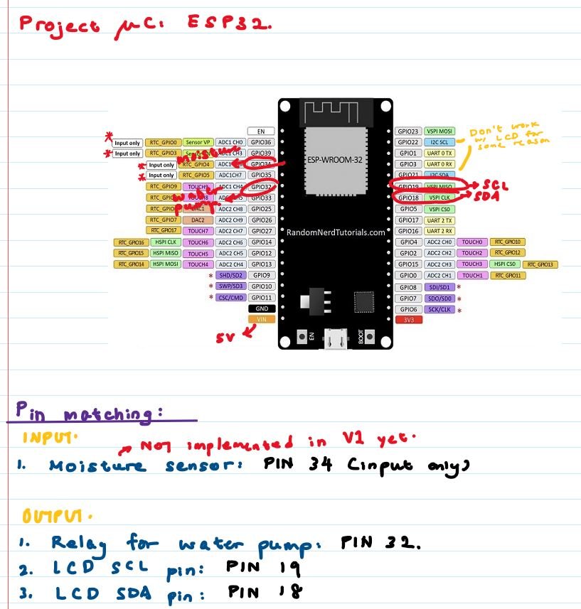
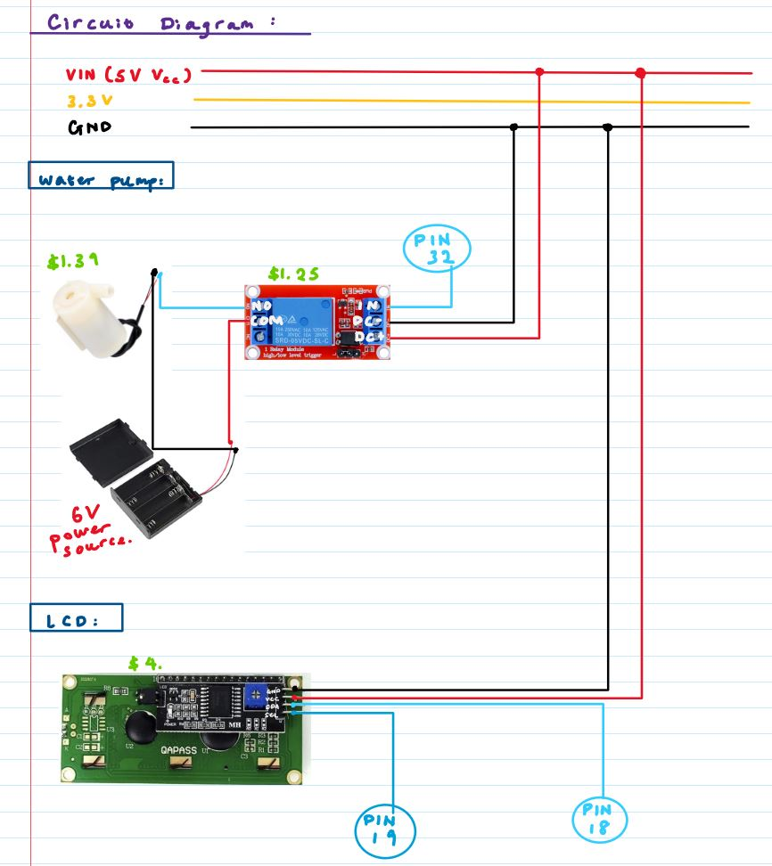

# Auto-Mobile-Plant-Watering-System
<h2> Personal Project Description </h2>

This project was initiated to address the problems and struggles of a gardener not having time (or forgetting) to water their plants.
It features the use of an ESP32 to automate the watering of plants in fixed intervals (i.e. automatically water the plants every 1 week). On top of the automatic plant watering feature, an Android Application was also developed, to give users the opportunity to water their plants while being away from it. After using app/phone watering, the ESP32 will automatically update to the right interval for the next plant watering session, following the time from app/phone watering.

The ESP32 and Android app are conencted via ThingSpeak MQTT, and all communication is done securely, via TLS/SSL.

Have a watch a the project video: <a href="https://youtube.com/shorts/qeQA9wZjar8?feature=share">Click here</a>

<h2> Project Schematics </h2>
</img>
</img>

 
